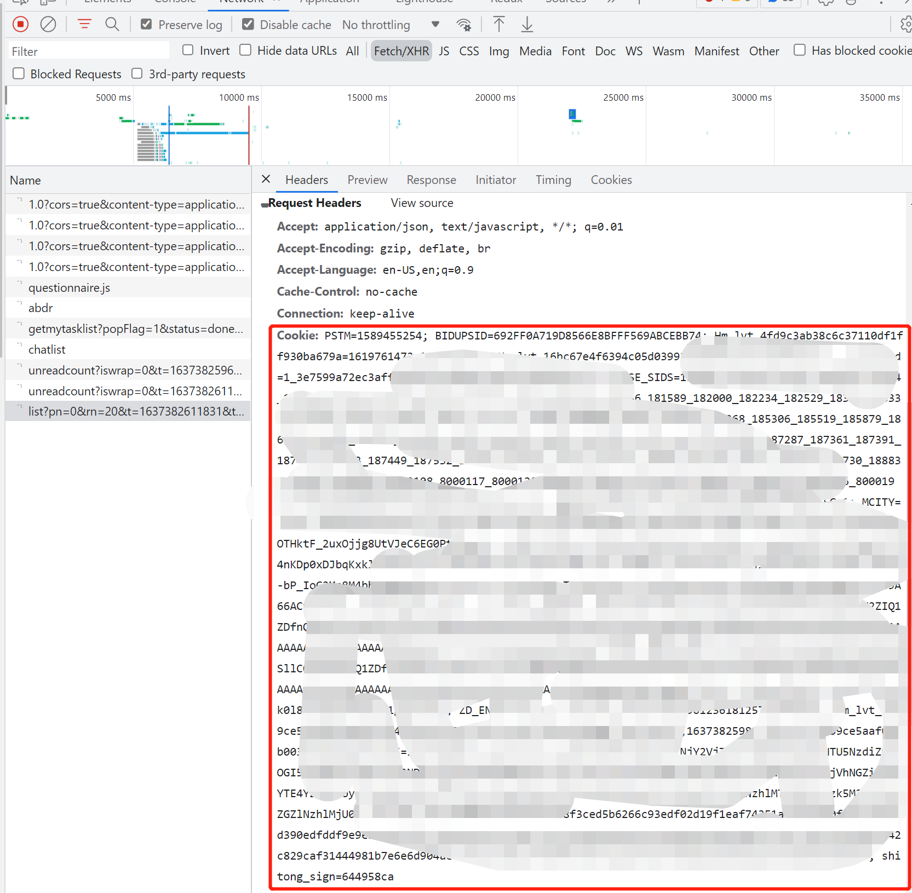
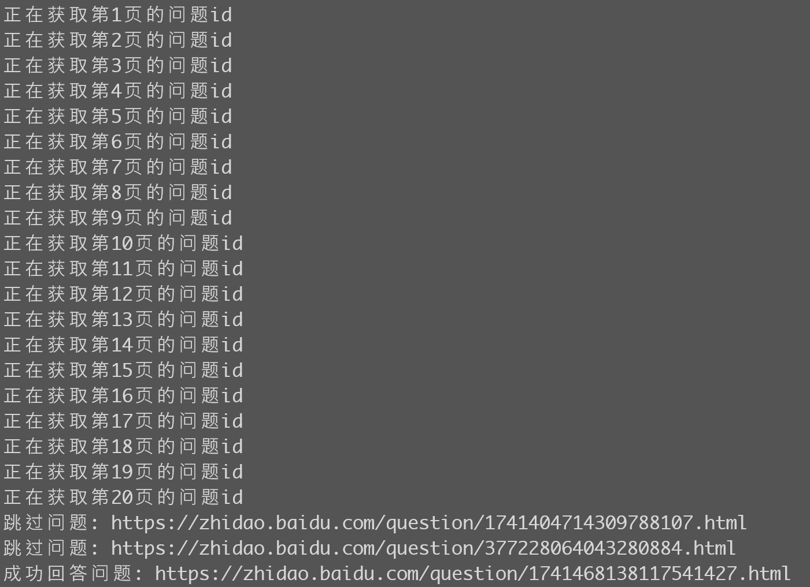
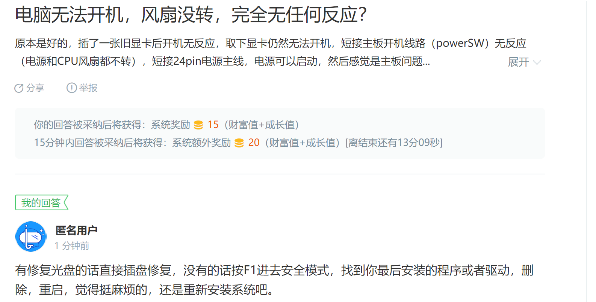

## 百度知道自动答题

> 以百度知道中的搜索结果作为回答内容，有些 stupid，若有需要可重写 `get_answer` 函数

> 仅供学习参考，Python 3.8.1 编写

### 配置

首先安装对应的包

```bash
pip install -r requirements.txt
```

在 [`zhidao.baidu.com`](https://zhidao.baidu.com/) 中手动登录之后在 [`config.json`](config.json) 中输入对应的 `cookie` ( <kbd>F12</kbd> 打开， 任意找个网络请求即可)



然后运行 [`main.py`](main.py) ，便可输出 `成功回答的问题` 链接，点进去查看确认

### 效果
运行 `main.py` 后：



跳过问题是因为没有获取到答案，点击到成功回答的问题，可以看到回答的内容：



